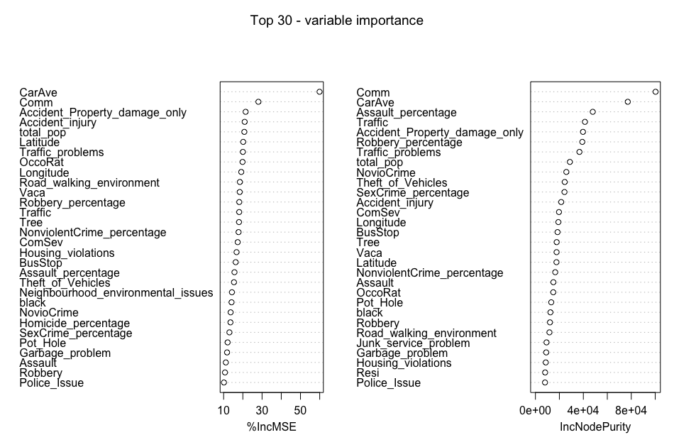

# 1. Introduction

Active transportation modes, such as walking and cycling, and their benefits to the enhancement of public health, quality of life, and urban redevelopment, have attracted growing interest in recent years. The design of "walkable" city is seen as a key method for mitigating illnesses induced by a lack of exercise owing to automotive dependence. Furthermore, creating vibrant street life has already been adopted as a critical urban redevelopment strategy in the United States and many other countries. While there have been many studies in the past that have objectively and quantitatively examined the impact of the built environment on street dynamism, a large number of studies have generally focused on motorized modes of transportation and neglected studies on pedestrians. <br/><br/>Understanding the underlying relationship between spatial patterns of pedestrian activity, aggregation or dispersion, and environmental features is critical. This helps city planners focus on pedestrian safety. Today, advances in remote scanning technology are used in intelligent transportation systems and public safety evacuation research. Therefore, monitoring pedestrian activity and movement makes it easier to understand complex collective behaviors in social systems. Building on previous work, this study uses K-Mean and random forest algorithms in machine learning to study the spatial patterns of pedestrian numbers, built environment contributors, and spoilers on eight high-traffic streets in Buffalo, New York. Pedestrian generators, demographic characteristics, crime rates, and land-use combinations were included as independent variables to investigate the impact of neighborhood environmental characteristics on pedestrian willingness to walk.

```{r}
#Import packages we may use
knitr::opts_chunk$set(echo = TRUE, warning = F, message = F)
library(ggplot2)
suppressPackageStartupMessages(library(tidyverse))
library(animation)
suppressPackageStartupMessages(library(viridis))
library(naniar)
suppressPackageStartupMessages(library(sf))
suppressPackageStartupMessages(library(lubridate))
library(gganimate)
suppressPackageStartupMessages(library(transformr))
library(RColorBrewer)
suppressPackageStartupMessages(library(magick))
suppressPackageStartupMessages(library(randomForest))
library(fastDummies)
```
# 2. Literature Review

There is already literature that discusses how to increase the liveliness of the street, dating back to Jacobs' desire for variety at both the district and street level. Jacobs strongly promotes the intelligent use of street life to revitalize older neighborhoods, which has resulted in dense, mixed-use clusters, by examining a number of areas in New York City. Kevin Lynch conducts research via enhancing urban form and from the viewpoint of locals. studying urban perception to increase vigor on the streets Jan Gehl uses the qualities of space to welcome or repel, and White discovers that street design and building layout are essential to fostering a thriving street life. Rowley thinks that beautiful street designs and mixed-use structures promote street vitality and boost regional economy. The relationships between urban planning, pedestrian activity, and consumer behavior have also been researched. In order to increase walkability, American cities have taken a variety of measures, such as building housing in downtown areas, enhancing public transportation, and creating supportive community structures. A theoretical framework has been established by earlier research to explore the possibility of altering built environments to increase street dynamism. The researchers also mention the clustering of pedestrian activity and the connection between pedestrian activity and the built environment, to a certain extent. However, quantitative investigations of the link between community environment and pedestrian activity, and associated modeling tools, were only established in the early 2000s due to the absence of adequate spatial methodologies.

## 2.1. Built Environment and Pedestrians

Destination accessibility emphasizes the critical part that amenities play in luring pedestrians. According to Purciel et al. and Ewing et al., the amount of street furniture, the percentage of windows on the street, and the percentage of active street frontage are all aspects of the streetscape that are positively connected with pedestrian traffic. The definition of "pedestrian generator" in our model was developed with the help of destination accessibility and streetscape planning. According to studies on the relationship between the built environment and travel intention, "pedestrian generators" are places at each junction that have a high pedestrian foot traffic, such as eateries, museums, parks, etc.

## 2.2. Pedestrian demand modeling and random forest

So far, many models have been used to simulate and study pedestrian flow and crowd dynamics. Sathish & Venkatesh used a random forest approach to study the relationship between pedestrian, driver, and environmental characteristics with the aim of investigating factors that significantly influence the severity of pedestrian injuries caused by pedestrians. Yang et al. used machine learning methods such as support vector machines (SVM), ensemble decision trees (EDT), and k-nearest neighbors (KNN) to study the relationship between pedestrian survival and traffic accident scenarios. Sababa used a random forest model to study the relationship between pedestrian traffic accidents and the community environment. However, these research models are uninterpretable black box models, however, interpretable machine learning models are important, as data scientists need to prevent model bias and help decision makers understand how to use our models correctly. The more severe the scenarios, the more the models need to provide evidence of how they work and avoid mistakes. In addition, since most of the current research focuses on the relationship between traffic accidents and people, no one has used the random forest model to explain the relationship between people's travel intention and community environment. Therefore, an interpretable random forest regression model based on SHAP was applied in this study to study the characteristics of streets that attract people to walk. SHAP is a "model interpretation" package developed in Python that can interpret the output of any machine learning model. Its name comes from SHapley Additive exPlanation. Inspired by cooperative game theory, SHAP builds an additive explanation model, and all features are regarded as "contributors". For each predicted sample, the model produces a predicted value, and the SHAP value is the value assigned to each feature in that sample.

# 3. Case studies and Data Collection

## 3.1. Study area

Eight high-traffic streets in Buffalo were selected for the fieldwork for this study.<br/> <br/> 
<figure>
  
  <figcaption>Figure 1</figcaption>
</figure>
<br/> <br/>
In Figure 1, the study area is depicted. These eight streets were selected as the study's locations because they act as the city of Buffalo's main thoroughfares. The Lower West Side, Downtown, West Side, and North Buffalo are just a few of the most significant areas that these boulevards—which are predominantly business boulevards—pass through. According to the 2007 Great Places in America Program of the American Planning Association, Elmwood Village on the West Side was ranked as the third-best neighborhood. There are many different restaurants, art galleries, museums, shops, cafés, and other establishments. These "catalysts" encourage foot circulation to and from local businesses, which dramatically accelerates neighborhood development. One of the few vibrant sectors that fuels Buffalo's economy is the area surrounding the avenue. The public has a variety of parks, schools, and public areas where they may congregate, walk, and play. As a component of the Olmsted Park and Parkway network, these avenues cut across Delaware Park's western section. The park system offers a variety of spots for people to unwind and take in the beauty, drawing both locals and visitors.

## 3.2. Data Collection

The Greater Buffalo Niagara Regional Transit Commission's (GBNRTC) Transportation Data Management System was used to gather information about traffic flow, pedestrian movement, geographical data at street crossings, and count dates and times for every intersection along the avenue. The study also gathered geographic data on "pedestrian generators," such as restaurants and other eating establishments, supermarkets and markets, art galleries, event venues, office and retail complexes, trees, etc.; population makeup; crime statistics by type; traffic accidents; and land use portfolio with reference to Buffalo tax parcels. Shapefiles include geocoded tabular information on the locations of pedestrian generators. Every 15 minutes, eight hours every day, pedestrian counts are taken at each intersection of a road. 7am to 10am, 12pm to 2pm, and 3pm to 6pm are the designated times of the day. Few datasets contain information from January, the coldest month in Buffalo, even though data were gathered from May to August from 2009 to 2020. The study used pedestrian counts to gauge the vibrancy of the streets.

```{r}
#This R chunck plots pedestrian distribution at observed time slots
data=read_csv('data/CCCCCCDep.csv')
#Only use useful part
data=data[,-c(4,7)]
#Create an sf class for plot
data.sf=st_as_sf(data,coords=c('Longitude','Latitude'))
data.sf=st_set_crs(data.sf,'WGS84')
data.sf=st_transform(data.sf,32618)
data.sf=data.sf[!duplicated(data.sf),]
#See how pedestrian number distributed
ggplot(data.sf)+
  geom_boxplot(aes(,PedAve))+theme_bw()
#Logged Pedestrain counts for a better color difference
data.sf$logged_Pedestrian=log2(data.sf$PedAve)
data.sf=data.sf%>%
  mutate_if(is.numeric, function(x) ifelse(x<0,0,x))
c(min(unique(data.sf$logged_Pedestrian)),max(unique(data.sf$logged_Pedestrian)))
data.sf$starttime=as.character(data.sf$starttime)
colnames(data.sf)[1]='intersection_id'
#Animated plot
plott=ggplot(data.sf,aes(color=logged_Pedestrian,size=logged_Pedestrian,stroke=1.2))+
  geom_sf()+
  scale_color_distiller(palette = "Spectral")+theme_bw()+
  transition_states(starttime,transition_length=1,state_length = 5)+
  labs(x='Logitude',y='Latitude',title=paste('Time :', '{closest_state}'))
#Run the anime!
animate(plott)
```

## 3.3. Data Processing

To determine the number of adjacent pedestrian generators, this study determines the radius of each intersection. 0.25 miles is frequently used as the acceptable walking distance in studies conducted in the United States. Walking distance and time are variable depending on the objective and demographic. In order to calculate the pedestrian generator, this study settled on a fair walking distance of 0.25 miles from each intersection. In this study, pedestrian generators were counted inside a network radius buffer of 0.25 miles that was created using network analyst at each intersection along the eight chosen roadways (shown in Figure 2). Population, crime, and traffic accidents are often used as objective measurements to evaluate the walkability of neighborhoods as one of the three-dimensional factors (density, variety, design). Social Explorer, ACS 2015 (5-year estimates), at the census block group level, provided information on the population composition in the area surrounding each junction. Data on crime, 311 sever and traffic accident are from the Buffalo Open Data period of 2009 to 2020. See Table 1 for detailed data information.

<figure>
  
  <figcaption>Figure 2</figcaption>
</figure>

# 4. Random Forest Regression Model

```{r}
#Read data table
table=read_csv('data/RunDataTest.csv')%>%as.data.frame()
#Check data availability
check=table%>%
  miss_var_summary()
#Check if there are columns with NAs
unique(check$n_miss)

#Keep the original data
model_table=table
colnames(model_table)
#column names changing for model fitting
colnames(model_table)[15]='Housing_violations'
colnames(model_table)[16]='Police_Issue'
colnames(model_table)[17]='Pot_Hole'
colnames(model_table)[18]='Road_walking_environment'
colnames(model_table)[19]='Traffic_problems'
colnames(model_table)[20]='Garbage_problem'
colnames(model_table)[21]='Junk_service_problem'
colnames(model_table)[22]='Neighbourhood_environmental_issues'
colnames(model_table)[28]='Accident_Property_damage_only'
colnames(model_table)[29]='Accident_skyway'
colnames(model_table)[30]='Accident_injury'
colnames(model_table)[31]='Assault_percentage'
colnames(model_table)[32]='Homicide_percentage'
colnames(model_table)[33]='Robbery_percentage'
colnames(model_table)[34]='SexCrime_percentage'
colnames(model_table)[35]='NonviolentCrime_percentage'
colnames(model_table)[36]='Theft_of_Vehicles'
colnames(model_table)
#Model fitting
set.seed(1)
train_rows=sample(nrow(model_table),dim(model_table)[1]*0.8)
train_set=model_table[train_rows,]
test_set=model_table[-train_rows,]
test_x=test_set[,-1]
test_y=test_set[,1]

PedAve.rf <- randomForest(PedAve ~ ., 
                         data = train_set,
                         importance = TRUE,
                         ntree=400,
                         xtest=test_x,
                         ytest=test_y,
                         keep.forest=TRUE)

#Model evaluation
print(PedAve.rf)
plot(PedAve.rf)
```

```{r}
#30 most important attributes
#varImpPlot(PedAve.rf, n.var = min(30, nrow(PedAve.rf$importance)),
           #main = 'Top 30 - variable importance')

```

This research also uses the SHAP machine learning model to explain the model at the end. The generation and verification of the model is carried out in Python, because Python provides a better API to operate the SHAP explanation model. The generated results are shown in Figure 3.

<figure>
  
  <figcaption>Figure 3</figcaption>
</figure>

# 5. Discussion and Conclusion

